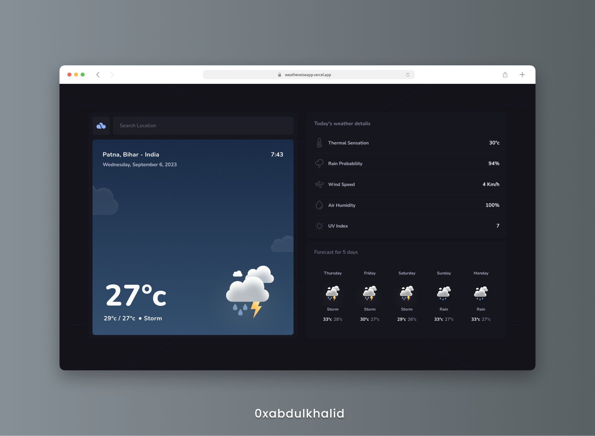
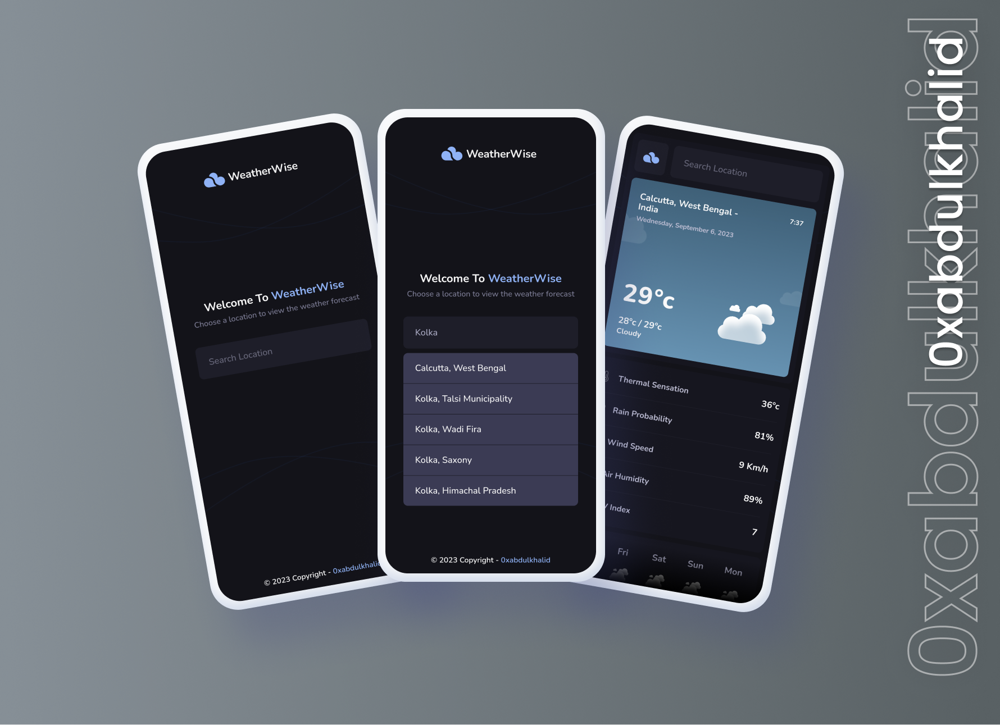

<br>

<div align="center">

<br>
<br>
  
Unlocking the World of Weather Trends and Providing Insights You Can Trust.

<br>
  <p>
    <a href="https://weatherwiseapp.vercel.app/">View Demo</a>
    &nbsp;·&nbsp;
    <a href="https://github.com/0xabdulkhalid/weatherwise/issues">Report Bug</a>
    &nbsp;·&nbsp;
    <a href="https://github.com/0xabdulkhalid/weatherwise/issues">Request Feature</a>
  </p>
</div>

<!-- Badges -->
<div align="center">

  

</div>

## Preview

<div align='center'>


</div>

<br>

## **Links**

- |||
  | :----- | :----- |
  | Demo: | [https://weatherwiseapp.vercel.app/](https://weatherwiseapp.vercel.app/)  |
  | Backend: | [https://github.com/0xabdulkhalid/weatherwise-backend](https://github.com/0xabdulkhalid/weatherwise-backend) |
  |||

<br>

## Pagespeed Insights Score
  
- ||
  | :-----: |
  |  <b>Overall Score 99.3%, Average of Mobile and Desktop</b><br>(Mobile devices score is shown below) |
  | |
  |  |
  | |
  | Check out [**Pagespeed Insights**](https://pagespeed.web.dev/analysis/https-weatherwiseapp-vercel-app/0k686bqwj5?form_factor=mobile) to get live score |
  ||


<br>

## Features

- **ES6 Modules**: JavaScript code is organized into ES6 modules for improved maintainability.

- **Webpack Bundling**: Optimize resource loading by bundling JavaScript modules with Webpack.

- **API Integration**: The core functionality of the app is to display real-time weather data. To achieve this, you've integrated external weather APIs, which provide up-to-date weather information to your application.

- **Backend Security**: Enhanced security by creating a backend with Express.js to hide API keys.

- **Location Search**:  Implemented a Geolocation API that enables users to initiate location searches through a search bar. The API returns a list of matching results, allowing users to select their desired location before retrieving weather information. This user-friendly approach streamlines the process of obtaining weather data for specific locations.

- **User-Friendly Interface**: Include a search bar and real-time data updates for a seamless user experience.

- **Cross-Browser Compatibility**: Ensure smooth performance across various web browsers.

- **Responsive Design**: Adapt to different screen sizes for a mobile-friendly experience.

- **Code Formatting Guidelines**: The project adheres to coding standards and maintains code consistency by implementing ESLint along with Prettier for code formatting.

- **Automated Deployment with Vercel**: Leveraging Vercel's automation capabilities, the project seamlessly handles the build process, which includes minifying HTML and CSS and bundling JavaScript with Webpack using npm scripts. These optimizations are automatically triggered by Vercel upon each GitHub commit, ensuring that the latest optimized code is deployed to production.

<br>

## Built With

<div align=center>

  &nbsp; &nbsp; &nbsp; &nbsp; &nbsp; &nbsp;

</div>

<br>

## Tools Used

<div align=center>
  
 &nbsp;&nbsp; &nbsp;&nbsp; &nbsp;&nbsp; &nbsp;&nbsp;

</div>

<br>


## Installation

To set up the WeatherWise Application locally, follow these steps:

1. Clone the GitHub repository to your local machine:

   ```bash
   git clone https://github.com/0xabdulkhalid/weatherwise.git
   ```

2. Navigate to the project's directory:

   ```bash
   cd weatherwise
   ```

3. Install the project's dependencies using npm:

   ```bash
   npm install
   ```

4. Build the project to bundle JavaScript, minify HTML and CSS, and move images:

   ```bash
   npm run build
   ```
5. The build files can be found on `dist` (distribution) directory.
6. For API setup and backend configuration, please follow the instructions in the [WeatherWise Backend Repository](https://github.com/0xabdulkhalid/weatherwise-backend).

<br>

## Acknowledgment

- Design credit goes to [RocketSeat](https://www.rocketseat.com.br/)
- WeatherWise is powered by [Open Meteo](https://open-meteo.com/) & [WeatherAPI](https://www.weatherapi.com/) 

<br>

## Let's Connect 👋

<div align=center>

  <a href="https://linkedin.com/in/0xabdulkhalid" >
    
  </a>&nbsp;&nbsp;

  <a href="mailto:0xabdulkhalid@gmail.com" target="_blank">
    
  </a>&nbsp;&nbsp;

  <a href="https://www.github.com/0xabdulkhalid/" >
    
  </a>

</div>

<br>